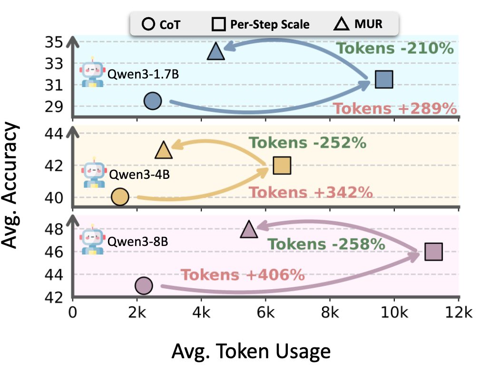

<h1 align="center">
MUR: Momentum Uncertainty Guided Reasoning For Large
Language Models
</h1>

<p align="center">
  <!-- <a href="https://github.com/yayayacc/MUR/"><b>[🌐 PyPi Package]</b></a> • -->
  <!-- <a href="https://arxiv.org/abs/2503.13288"><b>[📜 Paper]</b></a> • -->
  <a href="https://github.com/yayayacc/MUR/"><b>[🐱 GitHub]</b></a>
  
</p>

<p align="center"> Repo for MUR: Momentum Uncertainty Guided Reasoning For Large Language Models</a>"</p>
<!-- "<a href="https://arxiv.org/abs/2503.13288" target="_blank"> -->

## 🔥 News

- [2025/07/19] 🔥🔥🔥 Our github repo is released!!!

## 📖 Results

MUR reduces computation by over 50\% on average across three backbone models, while improving accuracy by 0.62–3.37\%.

<p align="center">
    
</p>

🚀 Quick Start

To use MUR, we can try with the following command.

Firstly, create the environment and install the requirements. This implementation is accelerated and supported by vllm.

```bash
# env
conda create -n mur python==3.11.9
conda activate mur
pip install -r requirements.txt
```

Next, simply run different python files.

## Citation

If you find it helpful, please kindly cite this repo.
